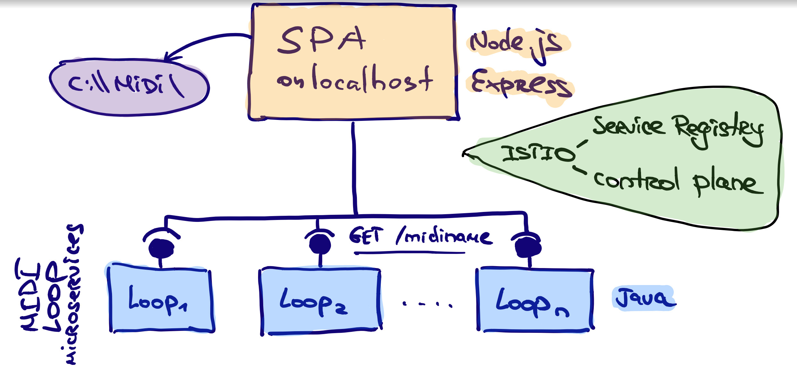

# Ziele
1. Rausfinden wo Istio für die Firma anwendbar wäre.
2. Istio gründsätzlich kennenlernen und folgende Features (u. A.) ausprobieren:
  * Orchestrierung
  * Unterschiedliche Protokolle
  * Security (TLS)
  * Load Balancing
  * Automation capabilities / API
3. Istio Use Case erfolgreich implementieren - ein Orchester mit einem Dirigent. Ein Microservice pro Ton.
```
> loop11, loop23, loop44
```


# Risiken
1. GCP Account mit der Istio Installation ist in der Gruppe nicht shareable
2. Netz in der Lokation ist instabil

# Ablauf und Organisation
* Wir starten am 11. September pünktlich um 8:00 mit Vorbereitung des Arbeitsplatzes. Wir werden dafür Zeit bis 8:30 haben, dannn kommt eine Keynote-Session für alle.
* Wir entwickeln mit privaten Laptops. Laptops, Bildschirme, Kabel, Tastatur und maus, Kopfhörer - bringt jeder für sich mit.
Es besteht eine Möglichkeit am 10. September bis 13:00 grosse Bildschirme aus dem Office zu transportieren.
* 1-2 weitere Steckleisten können sich als sehr praktisch erweisen.

# Software
* Wir nutzen github.com und vermeiden dort überall unsere Firma bei Namen zu nennen :)
* Wir deployen auf Google Cloud Platform (GCP)
* Wir nutzen Slack als Chat Plattform

# Vorbereitung
* Pits bereitet GCP account mit einer Istio Installation vor.
* Ein paar Kollegen versuchen sich dort einzuloggen (shareability tests)
* Wir probieren die [Doku](https://github.com/hack19-istio/documentation/tree/master/Introducing-Istio-Service-Mesh-for-Microservices) zu lesen und zu verstehen. Insbesondere den Orchestrierungsteil ;)  
